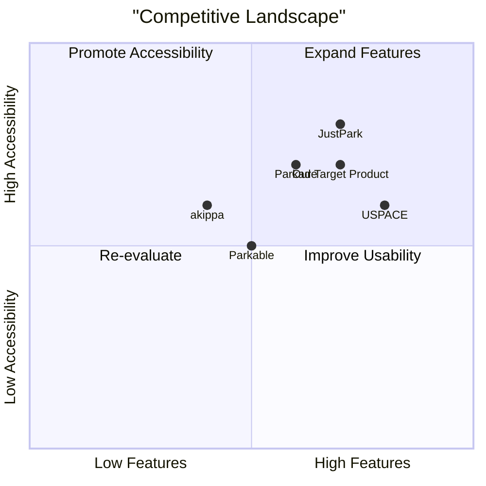

# Private Garage Rental App PRD

## Language & Project Info
- **Language**: English
- **Programming Language**: Node.js, Express, PostgreSQL, Firebase Admin SDK
- **Project Name**: private_garage_rental_app
- **Original Requirements**: 
  - Web app for renting private garage spaces for short-term use (daily).
  - Users can offer or book parking spots inside enclosed, personal garages.

## Product Definition

### Product Goals
1. Provide a secure and convenient platform for renting private garage spaces.
2. Enable garage owners to monetize unused spaces.
3. Offer drivers a reliable alternative to street parking.

### User Stories
1. As a garage owner, I want to list my garage with photos and details so that I can attract renters.
2. As a driver, I want to search for garages by location and price so that I can find a suitable parking spot.
3. As a user, I want to book a garage for a day so that I can park securely.
4. As a user, I want to view and manage my bookings so that I can keep track of my parking schedule.
5. As a user, I want to log in using Google or email/password so that I can access my account easily.

### Competitive Analysis

#### Competitors
1. **JustPark**
   - **Pros**: Established platform, large user base, secure transactions.
   - **Cons**: Limited focus on private garages.

2. **Parkade**
   - **Pros**: App-based, residential parking focus.
   - **Cons**: Limited international presence.

3. **USPACE**
   - **Pros**: Automated access control, LNPR technology.
   - **Cons**: Regional focus (Taipei).

4. **Parkable**
   - **Pros**: Management functionalities for parking owners.
   - **Cons**: Limited funding compared to competitors.

5. **akippa**
   - **Pros**: Easy search and booking.
   - **Cons**: Limited advanced features.

#### Competitive Quadrant Chart

## Technical Specifications

### Requirements Analysis
- **Authentication**: Email/password and Google login.
- **Garage Listing**: Photo upload, dimensions, access type, covered/uncovered, description.
- **Search & Booking**: Filter by location, price, access; view listing with images and info; book per day.
- **User Dashboard**: View and cancel bookings, edit profile.

### Requirements Pool
- **P0**: Authentication system, garage listing, search and booking.
- **P1**: User dashboard.
- **P2**: Notifications for bookings.

### UI Design Draft
- **Homepage**: Search bar, featured listings.
- **Garage Listing Page**: Photos, details, booking button.
- **Dashboard**: Booking history, profile settings.

### Open Questions
1. Should the app support long-term bookings?
2. What is the maximum number of photos allowed per listing?
3. Should there be a rating system for garages?

---

This document outlines the requirements and competitive landscape for the Private Garage Rental App. Further iterations may refine the details based on stakeholder feedback.
